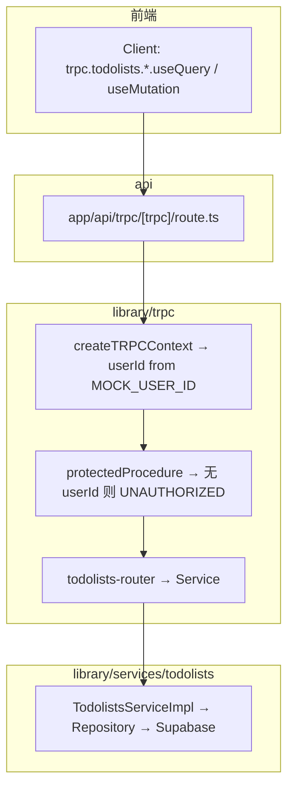

# tRPC 鉴权：Mock 用户 + protectedProcedure 实现方案

本文档描述在 `my-todolist` 中，为 **待办（todolists）** 相关 tRPC 接口接入「当前用户身份」的**开发期实现路径**：使用环境变量 **Mock `userId`**，并定义 **`protectedProcedure`** 拦截未登录请求。

面向个人学习，与 [`落地计划.md`](./落地计划.md) 第十三章（鉴权）衔接；Cookie 会话为后续阶段，本文不展开 Set-Cookie 细节。

---

## 一、目标与边界

### 1.1 目标（验收标准）

- 每次 tRPC 请求在 **`createTRPCContext`** 中可得到 `userId`（开发期来自 `MOCK_USER_ID`）。
- **`library/trpc/trpc.ts`** 导出 `protectedProcedure`：无 `userId` 时返回 `UNAUTHORIZED`。
- **`library/trpc/routers/todolists/todolists-router.ts`** 的 `list` / `create` / `update` / `delete` 全部使用 `protectedProcedure`，并向 Service 传入 `{ userId: ctx.userId }`。
- **`login.login`**、**`users.get`** 等演示接口继续使用 `publicProcedure`，行为不变。
- Mock 仅解决「我是谁」；**数据库仍通过 `DATABASE_MAIN_URL` 连接真实 Supabase**，不是内存假库。

### 1.2 非目标（本文不强制）

- 登录页、Cookie、`Set-Cookie` Route Handler（见落地计划阶段 7，后续单独做）。
- 在 `env.ts` 中强制声明 `MOCK_USER_ID`（可选，见下文「推荐 / 偷懒」两路径）。
- 修改 `TodolistsService` / Repository 业务逻辑（已按 `ctx.userId` 设计）。

### 1.3 安全底线（必读）

- **`MOCK_USER_ID` 不得提交到公开仓库**；只放在 `.env.local` 或团队约定的私有环境。
- **禁止**在待办接口的 `input` 中信任客户端传来的 `userId`；`userId` 只来自服务端 Context。
- Mock 为**临时开发手段**；合并主分支或上线前应改为 Cookie 会话，并移除或限制 Mock。

---

## 二、背景：为何要 Mock + protectedProcedure？

| 概念 | 含义 |
|------|------|
| `publicProcedure` | tRPC 层不检查是否登录，谁都能调用该 procedure。 |
| `protectedProcedure` | 自定义 middleware：Context 里没有 `userId` 则拒绝（`UNAUTHORIZED`）。 |
| Mock `userId` | 开发时把「当前用户」写死在环境变量，跳过登录页，仍能连**真库**操作自己的待办。 |

待办表 `public.todolists` 含 `user_id` 字段；Service 已约定第二参数为 `ctx: { userId: string }`。Router 必须把服务端认定的用户 id 传给 Service，且 tRPC 层应对无身份请求挡在门外。

---

## 三、调用链（改完后的形态）



---

## 四、实施前准备

### 4.1 从 Supabase 获取 Mock 用户 id

1. 打开 Supabase 控制台 → 表 **`public.users`**。
2. 任选一行（或你用来测试的账号），复制其 **`id`**（UUID 字符串）。
3. 该 id 必须存在于 `users` 表中，否则 `create` 可能因外键失败，`list` 可能始终为空。

### 4.2 确认当前代码状态（截至文档编写时）

| 文件 | 状态 |
|------|------|
| `library/trpc/context.ts` | 仅有 `container`、`signal`，**无 `userId`** |
| `library/trpc/trpc.ts` | 仅有 `publicProcedure`，**无 `protectedProcedure`** |
| `library/trpc/routers/todolists/todolists-router.ts` | 使用 `publicProcedure`；`list` 已传 `{ userId: ctx.userId }`，`create`/`update`/`delete` 仍传 **`ctx.userId` 字符串**（与 Service 签名不符） |
| `library/trpc/routers/index.ts` | 已合并 `todolists: todolistsRouter` |
| `library/services/registrations.ts` | 已注册 `TodolistsService` |

---

## 五、需要修改的文件清单

| 文件 | 必改 | 说明 |
|------|------|------|
| `.env.local` | ✅ | 增加 `MOCK_USER_ID=<uuid>` |
| `library/trpc/context.ts` | ✅ | 解析 Mock，注入 `userId` |
| `library/trpc/trpc.ts` | ✅ | 定义并导出 `protectedProcedure` |
| `library/trpc/routers/todolists/todolists-router.ts` | ✅ | 改用 `protectedProcedure`，统一 `{ userId: ctx.userId }` |
| `env.ts` | 可选 | 用 `createEnv` 声明 `MOCK_USER_ID` |
| `.env.example` | 可选 | 注释说明，勿填真实 uuid |
| `app/api/trpc/[trpc]/route.ts` | ❌ | 已调用 `createTRPCContext({ req })`，无需改 |
| `library/trpc/routers/index.ts` | ❌ | 已挂载 `todolistsRouter` |
| `library/trpc/routers/users/users-router.ts` | ❌ | 保持 `publicProcedure` |
| `library/trpc/routers/login/login-router.ts` | ❌ | 保持 `publicProcedure` |

---

## 六、分步实现

### 步骤 0：配置环境变量

在项目根目录 `.env.local` 增加：

```env
MOCK_USER_ID=00000000-0000-0000-0000-000000000000
```

将上述占位符替换为 Supabase `public.users` 中的真实 `id`。

修改后**重启** Next.js 开发服务器（`pnpm dev`），否则 `process.env` 不会刷新。

---

### 步骤 1：`library/trpc/context.ts`

**目的**：每个 tRPC 请求的 Context 带上 `userId?: string`。

**推荐实现**（直接使用 `process.env`，改动最少）：

```ts
import { createAppContainer } from "@/library/di/container";

function resolveUserId(): string | undefined {
  const id = process.env.MOCK_USER_ID?.trim();
  return id && id.length > 0 ? id : undefined;
}

/**
 * Creates context for tRPC requests. Container is request-scoped for testability.
 */
export function createTRPCContext(opts?: { req?: Request }) {
  const container = createAppContainer();
  return {
    signal: opts?.req?.signal,
    container,
    userId: resolveUserId(),
  };
}

export type Context = ReturnType<typeof createTRPCContext>;
```

**后续扩展（Cookie）**：在 `resolveUserId()` 内优先从 `opts?.req` 的 Cookie 解析；仅开发环境且未登录时再 fallback `MOCK_USER_ID`；生产环境不使用 Mock。

---

### 步骤 2：`library/trpc/trpc.ts`

**目的**：导出 `protectedProcedure`，无 `userId` 时抛出 `TRPCError`（`UNAUTHORIZED`）。

在现有 `export const publicProcedure = t.procedure;` 之后增加：

```ts
const enforceUserIsAuthed = t.middleware(({ ctx, next }) => {
  if (!ctx.userId) {
    throw new TRPCError({
      code: "UNAUTHORIZED",
      message: "Not authenticated",
    });
  }
  return next({
    ctx: {
      ...ctx,
      userId: ctx.userId,
    },
  });
});

export const protectedProcedure = t.procedure.use(enforceUserIsAuthed);
```

说明：

- `TRPCError` 已在文件顶部 import，无需新增依赖。
- middleware 通过后，procedure 内 `ctx.userId` 在类型上为 `string`，与 `TodolistsService` 第二参数一致。

---

### 步骤 3：`library/trpc/routers/todolists/todolists-router.ts`

**目的**：待办接口仅允许「有身份」的请求；Service 调用签名正确。

| 改动项 | 内容 |
|--------|------|
| import | `publicProcedure` → `protectedProcedure`（来自 `@/library/trpc/trpc`） |
| 四个 procedure | `list`、`create`、`update`、`delete` 均使用 `protectedProcedure` |
| Service 第二参数 | 统一为 `{ userId: ctx.userId }`（勿传裸字符串） |

**单条 procedure 模板**：

```ts
list: protectedProcedure
  .input(z.custom<TodolistsListRequest>())
  .query(({ input, ctx }) => {
    const todolistsService = ctx.container.services.getTodolistsService();
    return todolistsService.list(input, { userId: ctx.userId });
  }),
```

`create` / `update` / `delete` 同理，仅将 `.query` 换成 `.mutation`。

**可选**：在文件顶部增加与 `users-router.ts` 相同的注释，说明「Router 层仅 TS 类型，运行时校验在 Service」。

---

### 步骤 4（可选）：`env.ts` 声明 `MOCK_USER_ID`

若希望通过 `env.MOCK_USER_ID` 访问并参与类型检查，在 `env.ts` 中：

```ts
// server 内
MOCK_USER_ID: z.string().uuid().optional(),

// runtimeEnv 内
MOCK_USER_ID: process.env.MOCK_USER_ID,
```

`context.ts` 中改为：

```ts
import { env } from "@/env";
// resolveUserId 使用 env.MOCK_USER_ID
```

学习期可跳过本步，直接使用 `process.env.MOCK_USER_ID`。

---

### 步骤 5（可选）：`.env.example`

增加注释行，提醒协作者本地配置，勿提交真实值：

```env
# Dev only — fixed user id for tRPC before Cookie auth (uuid from public.users)
# MOCK_USER_ID=
```

---

## 七、与 `users-router` 的对比

| 项目 | `users-router` | `todolists-router`（本方案） |
|------|----------------|------------------------------|
| Procedure | `publicProcedure` | `protectedProcedure` |
| 是否需要 `ctx.userId` | 否 | 是 |
| Service 调用 | `usersService.get(input)` | `todolistsService.xxx(input, { userId: ctx.userId })` |
| 数据隔离 | 按 input 中的 `id` 查用户 | 按 Context 的 `userId` 过滤待办 |

---

## 八、自测清单

完成修改并重启 dev server 后，按序检查：

- [ ] TypeScript：`todolists-router.ts` 无 `ctx.userId` 不存在、第二参数类型错误。
- [ ] 配置 `MOCK_USER_ID` 后，调用 `trpc.todolists.list.useQuery({})` 可返回数据（或空数组但不报 401）。
- [ ] 临时删除或注释 `MOCK_USER_ID` 后，同一请求应得到 **UNAUTHORIZED**。
- [ ] `trpc.users.get`、`trpc.login.login`（若已挂载）在未配置 Mock 时仍可按原逻辑访问（公开接口）。
- [ ] `create` 写入的 `user_id` 与 Mock 用户一致（可在 Supabase `todolists` 表核对）。
- [ ] 使用他人 todo 的 `id` 做 `update`/`delete` 时，Service/Repository 应 0 行影响并映射为 NOT_FOUND 或 FORBIDDEN（见落地计划 11.1）。

---

## 九、常见问题

| 现象 | 可能原因 | 处理 |
|------|----------|------|
| 一直 `UNAUTHORIZED` | 未配置 `MOCK_USER_ID`、拼写错误、未重启 dev | 检查 `.env.local` 并重启 |
| `create` 外键或写入失败 | Mock id 不在 `public.users` | 换 Supabase 中存在的 `id` |
| IDE 仍报 `ctx.userId` 不存在 | 未改 `context.ts` 或 TS 服务未刷新 | 保存 `context.ts`，重启 TS Server |
| `create` 仍类型报错 | 第二参数仍是 `ctx.userId` 字符串 | 改为 `{ userId: ctx.userId }` |
| 以为 Mock 不接真库 | 误解 | `DATABASE_MAIN_URL` 不变，仅身份是 Mock |

---

## 十、后续演进（Cookie 鉴权）

合并主分支或进入阶段 7 时：

1. 登录成功 → Route Handler / Server Action **`Set-Cookie`**（`HttpOnly`、`SameSite`、`Secure`）。
2. 修改 **`resolveUserId()`**：从 `opts.req` 读取 Cookie，解析 uuid。
3. **`protectedProcedure` 与 `todolists-router` 可保持不变**。
4. 移除生产环境的 `MOCK_USER_ID`；开发环境可保留为 fallback（团队约定即可）。

详见 [`落地计划.md`](./落地计划.md) 第十三章。

---

## 十一、相关代码路径索引

| 用途 | 路径 |
|------|------|
| tRPC HTTP 入口 | `app/api/trpc/[trpc]/route.ts` |
| Context | `library/trpc/context.ts` |
| Procedure 定义 | `library/trpc/trpc.ts` |
| 待办 Router | `library/trpc/routers/todolists/todolists-router.ts` |
| 路由聚合 | `library/trpc/routers/index.ts` |
| 待办 Service 接口 | `library/services/todolists/todolists-service.ts` |
| 待办 Service 实现 | `library/services/todolists/todolists-service-impl.ts` |
| 请求 Schema | `library/services/todolists/todolists-request.schema.ts` |
| 前端 tRPC 客户端 | `library/trpc/client.ts`、`library/trpc/provider.tsx` |
| 总体落地步骤 | `docs/落地计划.md` |

---

*文档用途：个人学习 — 开发期 Mock 用户 + tRPC protectedProcedure，与 Supabase 真库联调 todolists。*
