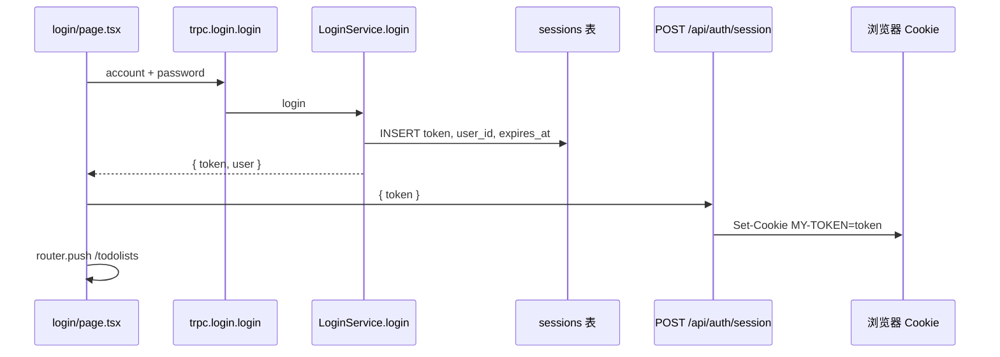
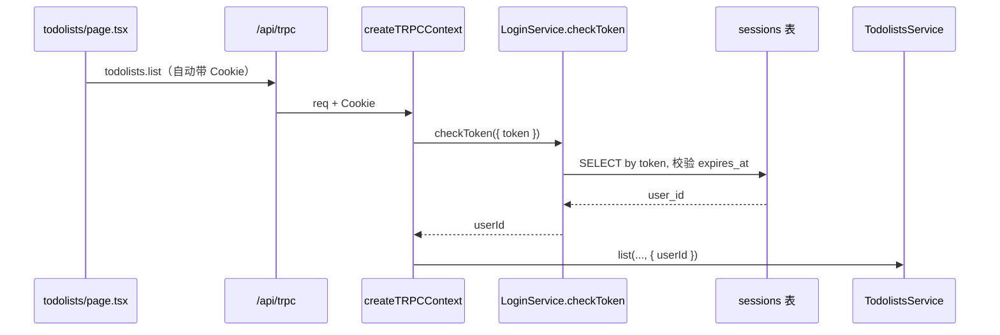

# 登录功能实现方案：会话 Token + DB 校验（checkToken）

本文档描述在 `my-todolist` 中，按「登录写 DB + Cookie 存随机 token → 每次请求 checkToken 查 DB」的完整落地路径。  
与 [`tRPC鉴权-Mock用户与protectedProcedure实现方案.md`](./tRPC鉴权-Mock用户与protectedProcedure实现方案.md)、[`落地计划.md`](./落地计划.md) 第十三章衔接。

---

## 一、目标与边界

### 1.1 目标（验收标准）

| # | 验收项 |
|---|--------|
| 1 | 登录成功：生成**随机 session token**，写入 `sessions` 表（含 `user_id`、`expires_at`） |
| 2 | 浏览器 Cookie 只存 **token**（`HttpOnly`），不直接存 `userId` |
| 3 | 每次 `/api/trpc` 请求：`createTRPCContext` 从 Cookie 取 token → `LoginService.checkToken` → 得到 `ctx.userId` |
| 4 | `todolists.*` 继续走 `protectedProcedure`，按 `ctx.userId` 过滤数据（**无需改 Router 业务**） |
| 5 | 退出登录：清 Cookie + 删除（或作废）DB 中对应 session |
| 6 | 未登录访问待办：返回 `UNAUTHORIZED`，前端跳转 `/login` |

### 1.2 非目标（本阶段可不做的）

- JWT / OAuth / 第三方登录
- 多设备会话管理 UI、刷新 token 轮换
- 在 tRPC `input` 里传 `userId` 或 `token`（身份只来自服务端 Cookie + DB）

### 1.3 核心概念（避免误解）

| 概念 | 正确理解 |
|------|----------|
| `login()` | **仅登录那一次**：验密码 → 建 session 行 → 返回 `token` |
| `checkToken()` | **之后每次请求**：用 Cookie 里的 token 查 DB，返回 `userId` |
| 「已登录」 | Cookie 里有 token **且** DB 能查到未过期的 session — **不是**「login 响应 JSON 里有没有 token 字段」 |

---

## 二、架构与调用链

### 2.1 登录（一次性）



### 2.2 访问待办（每次请求）



### 2.3 分层职责

| 层 | 文件 | 职责 |
|----|------|------|
| 页面 | `app/[locale]/login/page.tsx` | 调 `login` → 调 session API 写 Cookie → 跳转 |
| Route Handler | `app/api/auth/session/route.ts` | `Set-Cookie` / 清 Cookie；**不**写业务校验 |
| tRPC | `library/trpc/routers/login/login-router.ts` | `login` 仍为 `publicProcedure` |
| Service | `library/services/login/login-service-impl.ts` | `login`、`checkToken`、`logout`（可选） |
| Repository | `library/db/main/sessions/*` | CRUD session 行 |
| Context | `library/trpc/context.ts` | 读 Cookie → 调 `checkToken` → `ctx.userId` |
| 待办 | `todolists-router` + `protectedProcedure` | 保持不变 |

**原则**：`LoginService` **不**解析 HTTP Cookie；只接收 `{ token: string }`。

---

## 三、当前项目状态 vs 目标

| 项目 | 当前 | 目标 |
|------|------|------|
| `login-mapper` | `token = row.id`（即 userId） | `token =` 随机 UUID，session 行在 DB |
| Cookie | `sg_user_id` 存 userId（`context.ts` 直接解析） | `MY-TOKEN`（或统一常量）存 session token |
| `checkToken` | `login-service.ts` 未实现 | 查 `sessions` 表 |
| 登录页 | `localStorage.loginToken` | 以 Cookie 为准；`localStorage` 仅可选存 `loginAccount` 展示 |
| Mock | `MOCK_USER_ID` fallback | 开发可保留；验证真实登录时应注释 |

---

## 四、数据库：新建 `sessions` 表

### 4.1 表结构（建议）

| 字段 | 类型 | 说明 |
|------|------|------|
| `id` | uuid PK | 行主键（可选，与 token 二选一作主键） |
| `token` | varchar(64) unique | 随机 session token（`crypto.randomUUID()`） |
| `user_id` | uuid FK → `users.id` | 所属用户 |
| `expires_at` | timestamp | 过期时间（如 now + 7 天） |
| `created_at` | timestamp | 创建时间 |

### 4.2 操作步骤

1. 新建 Drizzle schema：`library/db/main/drizzle/schema/main-schema/sessions-table.ts`
2. 在 `library/db/main/drizzle/schema/index.ts`（或聚合导出处）导出 `sessionsTable`
3. 执行迁移：
   ```bash
   pnpm db:generate
   pnpm db:migrate
   ```
4. 在 Supabase 控制台确认表 `public.sessions` 已创建

### 4.3 Schema 示例

```ts
// library/db/main/drizzle/schema/main-schema/sessions-table.ts
import { timestamp, uuid, varchar } from "drizzle-orm/pg-core";
import { mainSchema } from "../main-schema";
import { usersTable } from "./users-table";

export const sessionsTable = mainSchema.table("sessions", {
  id: uuid("id").primaryKey().defaultRandom(),
  token: varchar("token", { length: 64 }).notNull().unique(),
  user_id: uuid("user_id")
    .notNull()
    .references(() => usersTable.id, { onDelete: "cascade" }),
  expires_at: timestamp("expires_at", { withTimezone: true }).notNull(),
  created_at: timestamp("created_at", { withTimezone: true }).defaultNow(),
});
```

---

## 五、Repository 层

### 5.1 新建文件

| 文件 | 说明 |
|------|------|
| `library/db/main/sessions/sessions-request.types.ts` | `create` / `findByToken` / `deleteByToken` 请求类型 |
| `library/db/main/sessions/sessions-response.types.ts` | 返回行类型 |
| `library/db/main/sessions/sessions-repository.ts` | 接口 |
| `library/db/main/sessions/sessions-repository-impl.ts` | Drizzle 实现 |

### 5.2 接口示例

```ts
export interface SessionsRepository {
  create(request: SessionsCreateRequest): Promise<SessionsCreateResponse>;
  findByToken(request: SessionsFindByTokenRequest): Promise<SessionsFindByTokenResponse>;
  deleteByToken(request: SessionsDeleteByTokenRequest): Promise<void>;
}
```

### 5.3 注册 DI

在 `library/db/main/registrations.ts` 增加：

```ts
SessionsRepository: (resolver) =>
  new SessionsRepositoryImpl(resolver.get(MainDbTokens.mainDbClient)),
```

---

## 六、Service 层：`login` + `checkToken`

### 6.1 修改 `library/services/login/login-service.ts`

```ts
export interface LoginService {
  login(request: LoginPostRequest): Promise<LoginPostResponse>;
  checkToken(request: { token: string }): Promise<{ userId: string }>;
  logout?(request: { token: string }): Promise<void>; // 可选，供 session DELETE 调用
}
```

### 6.2 `login` 改造要点（`login-service-impl.ts`）

1. 校验账号密码（保持现有 `usersRepository.findByAccount` + bcrypt）
2. `const token = crypto.randomUUID()`
3. `sessionsRepository.create({ token, userId: row.id, expiresAt: ... })`
4. `loginPostResponseMapper` 返回 `{ token, user }`（**token 不再是 user.id**）

```ts
import { randomUUID } from "node:crypto";

// login 成功后的核心片段（示意）
const token = randomUUID();
const expiresAt = new Date(Date.now() + 7 * 24 * 60 * 60 * 1000);

await this.sessionsRepository.create({
  data: { token, user_id: row.id, expires_at: expiresAt },
});

return loginPostResponseMapper(row, token); // mapper 增加 token 参数
```

### 6.3 `checkToken` 实现要点

```ts
async checkToken({ token }: { token: string }): Promise<{ userId: string }> {
  const trimmed = token.trim();
  if (!trimmed) {
    throw new ServiceError(new Error("missing token"), ServiceErrorCodes.LOGIN_FAILED);
  }

  const row = await this.sessionsRepository.findByToken({ token: trimmed });
  if (!row) {
    throw new ServiceError(new Error("invalid token"), ServiceErrorCodes.LOGIN_FAILED);
  }

  if (row.expires_at < new Date()) {
    throw new ServiceError(new Error("token expired"), ServiceErrorCodes.LOGIN_FAILED);
  }

  return { userId: row.user_id };
}
```

> 若需与 tRPC `UNAUTHORIZED` 对齐，可新增 `ServiceErrorCodes.UNAUTHORIZED` 或在 Context 捕获后映射。

### 6.4 注册 DI

`library/services/registrations.ts` 中 `LoginService` 注入 `UsersRepository` + `SessionsRepository`：

```ts
new LoginServiceImpl(
  resolver.get(MainDbTokens.usersRepository),
  resolver.get(MainDbTokens.sessionsRepository),
),
```

---

## 七、HTTP：Cookie 与 Session API

### 7.1 统一 Cookie 名

建议在单处定义常量（可新建 `library/auth/session-constants.ts`）：

```ts
export const SESSION_COOKIE_NAME = "MY-TOKEN"; // 与架构图一致
export const SESSION_MAX_AGE_SEC = 60 * 60 * 24 * 7;
```

### 7.2 修改 `app/api/auth/session/route.ts`

| 方法 | 行为 |
|------|------|
| `POST` | body: `{ token: string }` → `Set-Cookie(MY-TOKEN=token, HttpOnly, ...)` |
| `DELETE` | 读 Cookie 中 token → 调 `logout` 删 DB 行 → 清 Cookie |

**POST 示例（改后）：**

```ts
type SessionBody = { token?: string };

export async function POST(req: Request) {
  const body = (await req.json()) as SessionBody;
  const token = body.token?.trim();
  if (!token) {
    return NextResponse.json({ message: "token required" }, { status: 400 });
  }

  const res = NextResponse.json({ ok: true });
  res.cookies.set(SESSION_COOKIE_NAME, token, {
    httpOnly: true,
    sameSite: "lax",
    secure: process.env.NODE_ENV === "production",
    path: "/",
    maxAge: SESSION_MAX_AGE_SEC,
  });
  return res;
}
```

**DELETE 示例（需解析 Cookie + 删 DB）：**

可在 Route Handler 内 `createAppContainer()` 取 `LoginService`，或抽 `deleteSessionFromRequest(req)` 小函数。

---

## 八、tRPC Context（关键）

### 8.1 改为 async

`checkToken` 为异步，`createTRPCContext` 需改为 `async`，`app/api/trpc/[trpc]/route.ts` 中：

```ts
createContext: ({ req }) => createTRPCContext({ req }),
// fetch adapter 支持 Promise<Context>
```

### 8.2 `library/trpc/context.ts` 逻辑

```ts
async function resolveUserId(
  req: Request | undefined,
  container: ReturnType<typeof createAppContainer>,
): Promise<string | undefined> {
  const token = readCookieToken(req, SESSION_COOKIE_NAME);
  if (token) {
    try {
      const loginService = container.services.getLoginService();
      const { userId } = await loginService.checkToken({ token });
      return userId;
    } catch {
      return undefined; // 无效 token → 视为未登录
    }
  }
  return readMockUserId(); // 开发兜底，生产可移除
}

export async function createTRPCContext(opts?: { req?: Request }) {
  const container = createAppContainer();
  return {
    signal: opts?.req?.signal,
    container,
    userId: await resolveUserId(opts?.req, container),
  };
}
```

**删除**原先 `readCookieUserId` 直接把 Cookie 当 userId 的逻辑。

---

## 九、前端页面

### 9.1 `app/[locale]/login/page.tsx`

```ts
const loginMutation = trpc.login.login.useMutation({
  onSuccess: async (result) => {
    // 可选：仅 UI 展示
    localStorage.setItem("loginAccount", result.user.account);

    const resp = await fetch("/api/auth/session", {
      method: "POST",
      headers: { "Content-Type": "application/json" },
      body: JSON.stringify({ token: result.token }),
    });

    if (!resp.ok) {
      // 用现有 TrpcErrorPanel 或本地 state 提示
      return;
    }

    router.push("/todolists");
  },
});
```

- **移除** `localStorage.setItem("loginToken", ...)`（避免双轨）
- **不要**在前端调用 `checkToken` procedure；鉴权只在服务端 Context 自动完成

### 9.2 `app/[locale]/todolists/page.tsx`

对 `listQuery`（及必要时 mutation）在未授权时跳转：

```ts
useEffect(() => {
  if (
    isTRPCClientError(listQuery.error) &&
    listQuery.error.data?.code === "UNAUTHORIZED"
  ) {
    router.push("/login");
  }
}, [listQuery.error, router]);
```

### 9.3 退出登录（若有按钮）

```ts
await fetch("/api/auth/session", { method: "DELETE" });
localStorage.removeItem("loginAccount");
router.push("/login");
```

---

## 十、实施顺序（推荐按步勾选）

### 阶段 A：数据库与 Repository

- [ ] **A1** 新建 `sessions-table.ts` + 迁移
- [ ] **A2** 实现 `SessionsRepository` + `SessionsRepositoryImpl`
- [ ] **A3** 在 `registrations.ts` 注册 `SessionsRepository`

### 阶段 B：Service

- [ ] **B1** 更新 `login-service.ts` 接口（`checkToken`、可选 `logout`）
- [ ] **B2** 改造 `login()`：随机 token + insert session
- [ ] **B3** 实现 `checkToken()`：查 DB + 过期判断
- [ ] **B4** 更新 `login-mapper.ts`（token 来自参数，不是 `row.id`）
- [ ] **B5** `registrations.ts` 注入 `SessionsRepository`

### 阶段 C：Cookie 与 Context

- [ ] **C1** 修改 `app/api/auth/session/route.ts`：POST 收 `token`；DELETE 清 DB + Cookie
- [ ] **C2** `context.ts` 改为 async + Cookie token → `checkToken`
- [ ] **C3** 确认 `app/api/trpc/[trpc]/route.ts` 的 `createContext` 支持 async

### 阶段 D：前端与收尾

- [ ] **D1** 修改 `login/page.tsx`：session POST + 去掉 loginToken localStorage
- [ ] **D2** `todolists/page.tsx`：401 跳转登录
- [ ] **D3** 注释 `.env.local` 的 `MOCK_USER_ID`，跑通真实登录链路
- [ ] **D4** 更新 `docs/tRPC鉴权-*.md` 注明：生产路径为 session token + checkToken

---

## 十一、自测清单

| # | 操作 | 期望 |
|---|------|------|
| 1 | 正确账号密码登录 | `sessions` 表新增一行；Cookie 有 `MY-TOKEN` |
| 2 | 进入待办页 | `list` 返回该用户数据 |
| 3 | 注释 `MOCK_USER_ID` 后重复 1–2 | 仍成功 |
| 4 | 删 Cookie 或调 DELETE session | `todolists.list` → UNAUTHORIZED，跳转登录 |
| 5 | 用过期 token（手动改 DB `expires_at`） | `checkToken` 失败，待办 401 |
| 6 | 用户 A / B 各登录一次 | 待办数据按 `user_id` 隔离 |

---

## 十二、常见问题

| 现象 | 原因 | 处理 |
|------|------|------|
| 登录成功但待办 401 | Cookie 未写入或名不一致 | 检查 `SESSION_COOKIE_NAME` 与 session route |
| 仍看到 Mock 用户数据 | `MOCK_USER_ID` 仍在 fallback | 注释 Mock，确保 Cookie token 有效 |
| `checkToken` 从未执行 | Context 仍用旧 `readCookieUserId` | 按第八章改 async Context |
| Cookie 里是 userId 不是 token | 未改 session POST body | POST 应传 `result.token`（随机 UUID） |
| 以为要前端调 `checkToken` | 误解职责 | 仅 Context 内自动调用 |

---

## 十三、相关文件索引

| 用途 | 路径 |
|------|------|
| 登录页 | `app/[locale]/login/page.tsx` |
| 写 Cookie | `app/api/auth/session/route.ts` |
| tRPC 入口 | `app/api/trpc/[trpc]/route.ts` |
| Context | `library/trpc/context.ts` |
| 登录 Service | `library/services/login/login-service-impl.ts` |
| 登录 Router | `library/trpc/routers/login/login-router.ts` |
| 待办 Router | `library/trpc/routers/todolists/todolists-router.ts` |
| 鉴权中间件 | `library/trpc/trpc.ts`（`protectedProcedure`） |
| 用户表 | `library/db/main/drizzle/schema/main-schema/users-table.ts` |
| 会话表（新建） | `library/db/main/drizzle/schema/main-schema/sessions-table.ts` |
| 可视化说明 | `docs/visual/cookie-login-todolists-explainer.html` |

---

## 十四、与「Cookie 直接存 userId」方案的选择

| 方案 | 适用 |
|------|------|
| Cookie = `userId`（当前简化版） | 快速学习、个人 demo |
| **Cookie = token + sessions 表 + checkToken（本文）** | 与架构图一致、可过期/可吊销、更接近生产 |

完成本文方案后，**`protectedProcedure` 与 `todolists-router` 无需改动**，仅身份来源从 Mock / 裸 userId 升级为「DB 会话校验」。
